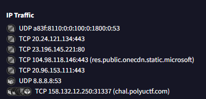

# Minesweeper - Writeup

## Files related to solving the challenge are in root folder

## Please open issue should you have any questions. It will be added to the respective Q&A section

Author: S051_Destroy Lai Lai's Machine (aka DLLM)

## Situation

Minesweeper

BOOM~ Mines is anywhere. How can you win this game :)

Author: SalaryThief\
Flag Format: PUCTF25{[a-zA-Z0-9_]+_[a-fA-F0-9]{32}}

Hint: N/A

Attachments:
`Minesweeper.zip`
(Stored at `Minesweeper.zip`)

## The Beginning

After unzipping, we find an executable `Minesweeper.exe` inside

Let's try to play it..

Whatever position I type, I get bomb'd

Time to brute force it

## The Beginning - checkpoint Q&A

Q - Why brute force instead of reverse engineer first\
A - Why not ;)\
Also mainly because I hate looking at mountains of assembly not knowing wtf is going on

## Brute force

Let's craft our program

```py
from pwn import *
#context.log_level = 'debug'

for i in range(25):
    for j in range(25):
        p = process("Minesweeper.exe")
        p.recvuntil(b"Enter your move as 'x y' (0 to 24).\r\nInput: ")
        p.send(b"{i} {j}\n")
        msg = p.recvuntil("\r\n")
        if b"BOOM! That cell contains a mine. You lose." in msg:
            p.close()
            continue
        else:
            print(msg)
            break
```

well there's no result

does it means that there are no solutions?

## Brute force - checkpoint Q&A

Q - Why is the program above not found in the files?\
A - It's useless :(

## Virustotal

After one time I afk for too long and the program responded me with

```none
Connection closed. You lose!
```

We know it did some communications with the internet.

since I dont have wireshark installed (unfortunately)\
this file was uploaded to [virustotal](https://www.virustotal.com/gui/file/7d5ba850fd66ae512ae88ea3999af4c1e1c1a80f2ae5dbeb8a98da45a79a3156/behavior). What did we found?

Good news, no virus (ofc)\
Even better news, the `Minesweeper.exe` communicates with polyuctf servers



I think that explains why we can't brute every location of the mine, the board randomizes every time.

Let's see what's in chal.polyuctf.com:31337

## Virustotal - checkpoint Q&A

Q - why don't install wireshark?\
A - :/

## Brute force 2.0?

After running this script

```py
from pwn import *
context.log_level = 'debug'
p = remote("158.132.12.250", 31337)
p.recvall()
```

and look at the log, we see this

```none
[x] Receiving all data
[x] Receiving all data: 0B
[DEBUG] Received 0x273 bytes:
    00000000  ff 19 00 00  00 00 00 00  00 00 00 00  00 00 00 00  │····│····│····│····│
    00000010  00 00 00 00  00 00 00 00  00 00 00 00  00 00 00 00  │····│····│····│····│
    *
    000000a0  00 00 00 00  00 00 01 00  00 00 00 00  00 00 00 00  │····│····│····│····│
    000000b0  00 00 00 00  00 00 00 00  00 00 00 00  00 00 00 00  │····│····│····│····│
    *
    00000270  00 00 00                                            │···│
    00000273
[x] Receiving all data: 627B
```

It seems that after 627 bytes, the server wants me to input something.

After some trials and errors, and a huge amount of `Unknown command.` response thrown onto my face, we know that the coords are inputted as bytes after the first byte being `\x01`.

we can also see there's a 01 in all the 00s in the response.

is the 01 the "not mine" square?

let's try

```py
from pwn import *

p = remote("158.132.12.250", 31337)
p.recv(3)
board = p.recv(625)
   
idx = -1
for i, square in enumerate(board):
    if square == 1:
        if idx != -1:
            print("tf 2 non mine")
        idx = i
    
p.send(bytes([1, idx%25, idx//25]))

msg = p.recvall()
    
print(msg)
```

damn it isn't

## Brute force 2.0? - checkpoint Q&A

Q - Why dont brute force it!!!\
A - will gah la

## Brute force 3.0

Screw it, we ball

brute it wooooo (in ./bruh.py)

```py
from pwn import *
while True:
    p = remote("158.132.12.250", 31337)
    p.recv(628)
    p.send(bytes([1, 0, 0]))
    msg = p.recvall()
    if b"BOOM! That cell contains a mine. You lose." in msg:
        p.close()
        continue
    else:
        print(msg)
        break
```

and then we get this

```none
b"\x02\x85Congratulations! You've uncovered the safe cell and won. Flag: PUCTF25{y0u_r3_min35w33p3r_pr3d1ct0r_ebd29056163c85911e01efbd10ec998f}"
```

so the flag is `PUCTF25{y0u_r3_min35w33p3r_pr3d1ct0r_ebd29056163c85911e01efbd10ec998f}`

## Brute force 3.0 - checkpoint Q&A

Q - why does it take forever here?\
A - bad luck, its luck based brute force

Q - Why `bruh.py`?\
A - bruh